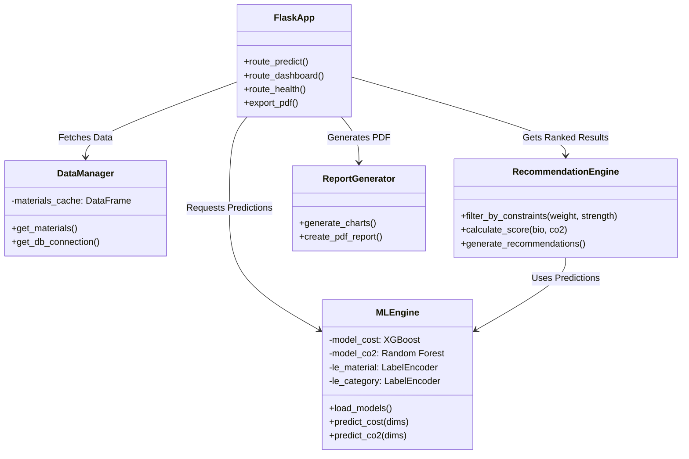
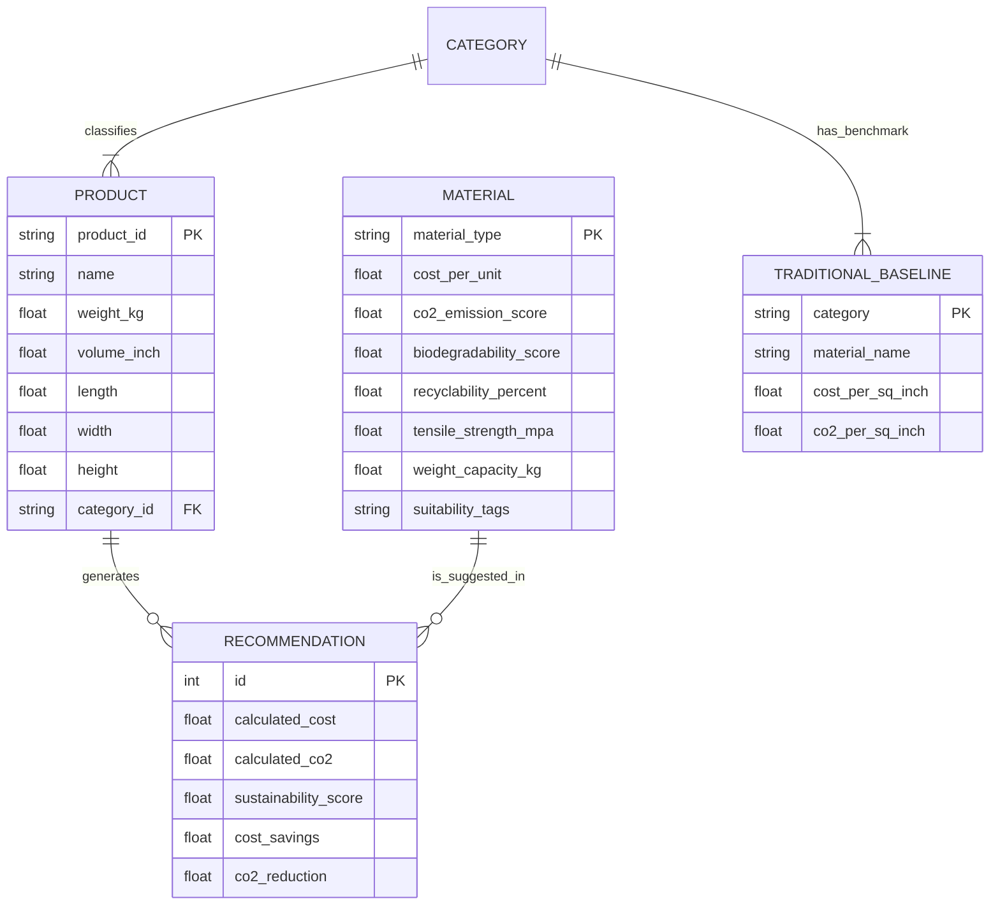

# 🌍 Project Description: EcoPackAI

**EcoPackAI** is an intelligent decision-support system designed to revolutionize packaging sustainability in e-commerce and logistics. It bridges the gap between profitability and environmental responsibility by using Artificial Intelligence to recommend optimal packaging materials.

## 🚀 The Problem
E-commerce businesses often rely on "traditional" packaging materials (like Styrofoam or virgin plastic) because they are cheap and familiar. However, these materials have a massive environmental footprint. Sustainable alternatives exist, but businesses lack the data to compare them effectively against traditional options in terms of cost, strength, and carbon impact.

## 💡 The Solution
EcoPackAI provides a real-time analytics dashboard and recommendation engine. Users input their product's dimensions, weight, and category, and the system suggests the best sustainable packaging materials that meet structural requirements while minimizing CO2 emissions.

## ⚙️ How It Works

1.  **Input Data**: The user provides package details (Length, Width, Height, Weight, Category).
2.  **AI Analysis**:
    *   **Material Filtering**: The system filters materials from its database that meet the required weight capacity and tensile strength.
    *   **Cost & CO2 Prediction**: Machine Learning models (XGBoost/Random Forest) estimate the specific cost and CO2 footprint for the given dimensions.
    *   **Scoring Algorithm**: Materials are ranked based on a weighted score of Biodegradability, Recyclability, and Carbon Reduction.
3.  **Comparison**: The system compares the recommended eco-friendly text materials against the "Industry Standard" for that category (e.g., comparing Mushroom Packaging vs. Styrofoam for electronics).
4.  **Visualization**: Results are displayed via interactive charts (Cost vs. CO2, Recyclability pie charts) and a downloadable PDF report.

## 📊 Dataset Details

### 1. Materials Dataset
*   **Total Materials**: 31 unique packaging materials
*   **Composition**: ~19 Eco-friendly alternatives vs ~12 Traditional baselines
*   **Key Attributes**:
    *   **Material Type**: (e.g., Mushroom Mycelium, Corrugated Cardboard)
    *   **Financial**: Cost per unit (₹/$)
    *   **Environmental**: CO₂ Emission Score, Biodegradability Score (0-100), Recyclability (%)
    *   **Structural**: Tensile Strength (MPa), Weight Capacity (kg)

### 2. Products Dataset
*   **Total Products**: 20,290 real-world product records
*   **Purpose**: Simulates diverse packaging scenarios for testing recommendations
*   **Key Attributes**:
    *   **Product ID**: Unique identifier
    *   **Category**: (e.g., Electronics, Food & Beverage)
    *   **Physical Metrics**: Weight (kg), Volume (inch³), Dimensions (L x W x H)
    *   **Target Category**: Mapped classification for material matching

## 🤖 Machine Learning & AI Logic

### Model Architecture
*   **Algorithms**: **XGBoost Regressor** & **Random Forest**
*   **Task**: Predicting **Cost** and **CO₂ Emissions** for unseen dimensions/materials
*   **Training**:
    *   **Split**: 80% Training / 20% Testing
    *   **Preprocessing**: **Label Encoding** for categorical variables (Material Type, Category)
    *   **Scaling**: No scaling required (Tree-based models are scale-invariant)

### Recommendation Engine (Scoring Logic)
Materials are ranked based on a composite **Sustainability Score**:
*   **Formula**: `Score = (Biodegradability * 0.5) + (CO₂ Reduction * 0.5)`
*   **Priority**: Sustainability > Cost
*   **Constraints**:
    *   **Hard Filter**: Material `Weight Capacity` must > Product `Weight`
    *   **Optimization**: Maximizes score while ensuring structural integrity

## 📈 Dashboard & BI Outputs

The dashboard visualizes the impact of switching to sustainable options:
1.  **Cost vs. CO₂ Analysis**: Bar/Line charts comparing traditional vs. eco-friendly options.
2.  **Sustainability Metrics**:
    *   CO₂ Reduction Percentage (e.g., "🌱 45% Cleaner")
    *   Biodegradability Score
    *   Recyclability Distribution (Pie Chart)
3.  **"What-If" Analysis**: Interactive scenario testing for different material choices.
4.  **Reporting**: Automated **PDF Report Generation** using `ReportLab` for stakeholder presentations.

## 🚀 Deployment & Infrastructure

Designed for cost-efficiency and scalability:
*   **Platform**: **Render** / **Google Cloud Run** (Serverless)
*   **Containerization**: **Docker** (Multi-stage build, Python 3.11-slim)
*   **Database**:
    *   **Primary**: **PostgreSQL** (Production)
    *   **Fallback**: In-memory caching with CSV persistence (Low-resource mode)
*   **Optimization**:
    *   **Lazy Loading**: ML models loaded only on inference to save startup RAM.
    *   **Memory Footprint**: Optimized to run strictly under **512MB RAM** (Free Tier compatible).

## 🛠️ Technologies Used

### Backend & Core Logic
*   **Python**: Primary programming language.
*   **Flask**: Web framework for serving the application and API.
*   **Pandas & NumPy**: Data manipulation and numerical analysis.

### Artificial Intelligence
*   **Scikit-learn**: Machine learning pipeline and pre-processing.
*   **XGBoost**: High-performance gradient boosting for regression models (Cost/CO2 prediction).
*   **Joblib**: Model serialization and lazy loading for memory optimization.

### Frontend & Visualization
*   **HTML5/CSS3**: Responsive, modern web interface.
*   **Matplotlib**: Server-side generation of complex charts for PDF reports.
*   **ReportLab**: Programmatic PDF generation.

### Infrastructure & DevOps
*   **Docker**: Containerization for consistent deployment across environments.
*   **PostgreSQL**: Robust relational database for material properties (with CSV fallback).
*   **Render / Google Cloud Run**: Serverless cloud deployment platforms.

## 🌟 Key Features & Impact

*   **🌱 Sustainability First**: Prioritizes materials with high biodegradability scores.
*   **💰 Cost Transparency**: Shows exactly how much extra a sustainable option might cost—or how much it might *save*.
*   **📊 Interactive Dashboard**: Visualizes the trade-offs between different packaging options.
*   **📄 PDF Reports**: Generates shareable reports for stakeholders to justify sustainable choices.
*   **⚡ Efficiency**: Optimized for low-latency predictions and minimal memory usage (running on 512MB RAM instances).

## 🔮 Future Scope
*   **API Integration**: Integration with shipping APIs (FedEx, DHL) for real-time shipping cost adjustments.
*   **Image Recognition**: Upload a photo of a product to automatically detect category and dimensions.
*   **Supplier Marketplace**: Direct links to suppliers for the recommended materials.

## 🏗️ System Architecture & Design

### 1. UML Class Diagram (High-Level Design)
This diagram represents the core components of the Flask application and their interactions.

### 2. Entity Relationship Diagram (ERD)
This diagram illustrates the relationship between Products, Materials, and Categories within the system's logic.

